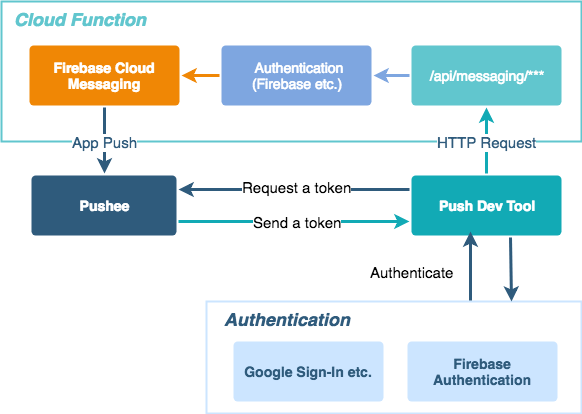

# Push notification endpoints for debug purposes

This is a template project to send notifications for the debug purpose.



## Set up

You need to set up a Cloud Function project and clients.

Please read [functions/README.md](./functions/README.md) to set up your Cloud Function.

### Try it on Android

There are two android applications which are a push receiver app and a push trigger app.
Please read [android-sample/README.md](./android-sample/README.md).

### Try it on your local without a push trigger applicaiton

To request functions' endpoints is required to trigger a push notification if you pass the authentication you've selected. That's mentioned in [functions/README.md](./functions/README.md).
And then, you just need to deploy your functions locally by `firebase serve --only functions:api"`

## Development

`functions` directory contains all source code of Cloud Function.  
Follow the official document : [get-started](https://firebase.google.com/docs/functions/get-started).

## LICENSE

```
MIT License

Copyright (c) 2018 Jumpei Matsuda

Permission is hereby granted, free of charge, to any person obtaining a copy
of this software and associated documentation files (the "Software"), to deal
in the Software without restriction, including without limitation the rights
to use, copy, modify, merge, publish, distribute, sublicense, and/or sell
copies of the Software, and to permit persons to whom the Software is
furnished to do so, subject to the following conditions:

The above copyright notice and this permission notice shall be included in all
copies or substantial portions of the Software.
```